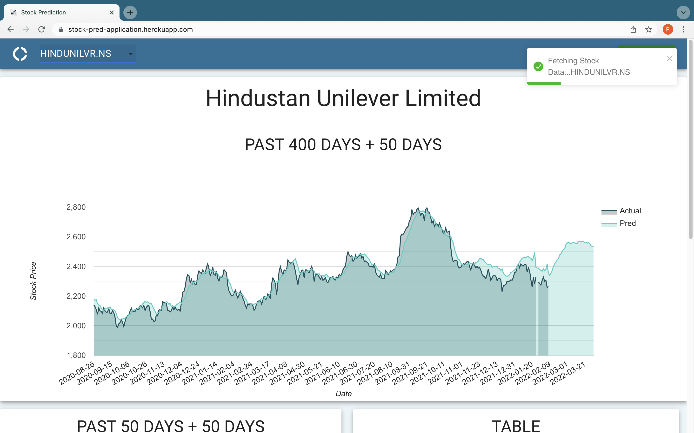
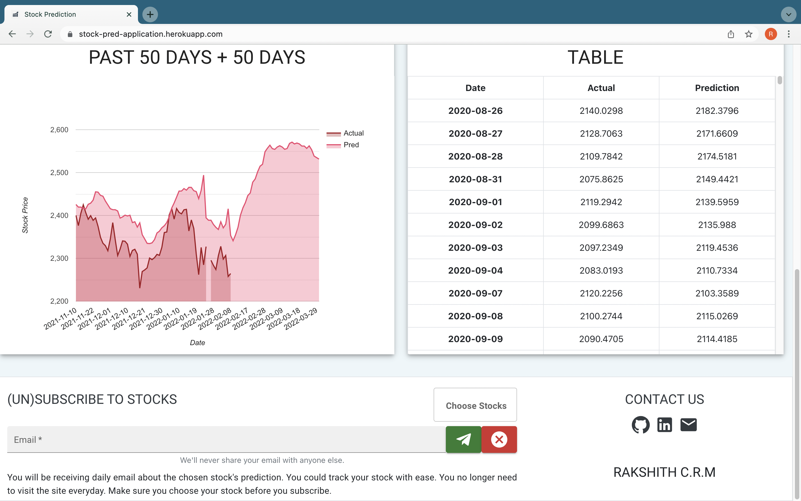

# Stock Prediction Application

A stock prediction application which allows users to request 
and subscribe for stock they want to forecast.

## Getting Started
---
Follow these instructions to have the project running on your local machine

### Quick Acess
- Python 3.9
- Clone this repo using the command
```git 
git clone https://github.com/rakshith-crm/StockCast.git 
```

- Then install required dependencies for the project
```python
pip install -r requirements.txt
```
- Open your terminal and run the following commands
```python
python manage.py runserver 0.0.0.0:8000
```
- Open your browser and go to localhost:8000 to view the site.

---

## Screenshots




---

# Contributors
* **Rakshith C.R.M** - [@rakshith-crm](https://github.com/rakshith-crm)
